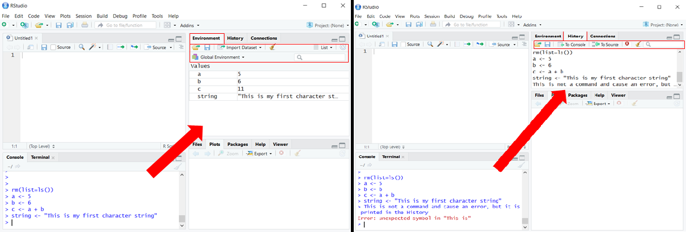

# Instructions to install R

Go to the [R-project website](https://cran.r-project.org/) and download the latest version of R.
Currently (2020-03-03), the latest and more stable version of R is R v3.6.3. The quickest way to install R is to download the
precompiled binary distributions of the base system and contributed packages,
so you can download the installer for either [Mac OS X](https://cran.r-project.org/bin/macosx/R-3.6.2.pkg)
or [Windows](https://cran.r-project.org/bin/windows/base/R-3.6.3-win.exe).
Then, please just follow the default installation settings, where you will only have to
choose your preferred location to install R. If you are a Mac user, note that you need to have XQuartz installed.

If you are a Linux user, please follow the instructions to install R according to your distribution:   

   * [Ubuntu](https://cran.r-project.org/bin/linux/ubuntu/README.html)   
   * [Debian](https://cran.r-project.org/bin/linux/debian/)   
   * [Red Hat](https://cran.r-project.org/bin/linux/redhat/README)   
   * [SuSE](https://cran.r-project.org/bin/linux/suse/README.html)   

# Instructions to install RStudio

Once you have R installed, we are going to install RStudio, a set of integrated tools designed to help you to be more productive with R.
Go to the [RStudio website](https://www.rstudio.com/products/rstudio/download/) and download the **FREE** installer version.
The current version (2020-03-03) is RStudio v1.2.5033. Please download the correct installer according to your platform,
i.e., Ubuntu, Windows, Mac OS X, etc.
Choose the location for the installer, execute it, and follow the **default instructions** to install it.
The only thing that you will have to specify during the installation procedure is where you want R to be installed.

After that, just open RStudio and you are ready to use R! :)  

  

# Working with RStudio

The layout of RStudio has 3 main panels, although a fourth panel is available when you open your scripts:

  

### (1) **The R console**
Here you can type the R commands and visualize the content of your objects. One of its most useful utilities is the code completion.
Imagine that you do not remember the proper spelling of a function you want to use (or you just do not feel like typing all
the word :stuck_out_tongue:). If you start typing part of its name, you will start to see how the R console lists all possible
functions that contain the letters you have typed, among which you might find the one you are looking for.
The code completion works also with the names you have given to your R objects during the current
R project session or that you have loaded from your script.

  

### (2) **Environment/History/Connections tabs**:
* **Environment** : Under this tab, you will see a list of everything you have defined/loaded/created during your R project session,
i.e., functions, data, packages...
You can also import your data sets from the `Import Dataset` button, although we recommend you to use the specific command for that
purpose (remember we are here to learn some programming! :muscle: ). You can also either save the current environment you are working
on or load a previous environment you have previously saved. For instance, this might be useful to do if your environment has objects
that have taken a while to create. Last, if you want to clean this environment (erase everything you have defined/loaded/created before),
you can click the brush button (or type `rm( list = ls() )` in the console! :smile:). Bear in mind that, once you do this, you will have
to run all the commands you used to create any data set you had in your environment before they were deleted.

* **History**: This tab lists **all** the commands you have typed and run in the R console from the first moment you started your project. This means that, even if one of your commands did not work or caused an error, it will be shown here. You can decide if you want to save the History of your project during your session or before closing RStudio, up to you!

* **Connections**: This tab is a new feature in RStudio and you can mainly use it to connect to different data sources. We are not going to use this during the workshop, but you can read more about it [here](https://support.rstudio.com/hc/en-us/articles/115010915687).

### (3) **Files/Plots/Packages/Help/Viewer tabs**: 
* **Files**: After setting your working directory *( **(a) pro mode**: type in the R console `setwd( path_to_your_wd )` || **(b) the other less fancy way**: Go to `Session > Set Working Directory > Choose Directory ...` and navigate through your filesystem until your working directory )*, you will see here all the files you have in this location. You can create new folders from here, rename your files, and any of the functions listed under the `More` button.

* **Plots**: Any plots you generate will be viewed here. You can zoom in, zoom out, save your plots, go from one plot to another using the arrows, etc. 

* **Packages**: From this tab, you can install any package you want to use in your R project session. However, we are not going to be using this tab for our project. We are going to use the command `install.packages( name_package )` to install our packages, which is a much faster and convenient way to install any package. However, you can have a look at the options provided under this tab.

* **Help**: Instead of having to google the documentation of any package you want to use, you can directly use this tab from where you can view it. You only need to type in the R console the question mark followed by the name of the command you have questions about and press `ENTER`. Automatically, you will see how the help documentation appears under the `Help` tab :smiley: 

* **Viewer**: Local web content can be viewed from this tab. However, we are not going to use this for the workshop, although you can visit [this website](https://support.rstudio.com/hc/en-us/articles/202133558-Extending-RStudio-with-the-Viewer-Pane) for more information about how to use it.

  

### (4) **Text editor panel**: 

This panel is only visible if you open a file to edit in RStudio. In order to do this, you can either open one of your scripts *( (i) Go to `File > Open File...` or (ii) find your script in your filesystem and choose to open with RStudio )* or start a new script from scratch. For the latter, press the button with a blank file and a green "+" and select the kind of file you want to open. For this workshop, we are going to be coding in R, thus you want to select `R script`. As you see here, you can also use the shortcut `ctrl+shift+N` to open a new R script file :smile:

  

# Some useful tips before getting started with R!

* We recommend you type all your commands in the R script instead of typing them in the R console. This is because you can save this R script as a file, which means that you can later open it and re-run everything that you have been doing during this workshop.

* If you want to run the commands you have typed in your R script in the R console, you do not need to copy and paste them from the editor to the console. You only need to type `ctrl+ENTER` (or `command+ENTER` for Mac users) having the mouse in the line you with the command you want to run and it will automatically be loaded and run into the R console. Alternatively, if you want to run some lines of the code you have in your R script, you can also select them with the mouse and type the shortcut while keeping the selection. 

* If you want to cancel a command that is running but you realised that will lead to a wrong output and/or an error, press the key `Esc`. If you were to run R from a terminal, take into account that you should use the shortcut `ctrl+C` instead!

* If you go to `Tools > Shell...` you will be able to open a terminal (not the R console, the shell terminal you have installed in your system) from RStudio!

* Start always a project session with the command `rm( list = ls() )` or, if you are running your own script, make sure this is the first command you have to be run. Specifically, this command will clean your environment, ensuring that any object from any other environment you might have been working with before affects your current project session. By doing this, you make sure that no possible conflict between two variables named the same way (one in your current project environment, another from previous environments that you might have loaded before) might happen.

* You can visit [R bloggers](https://www.r-bloggers.com/), where any news related to R tend to be reposted there. Therefore, it is a good place to visit if you are looking for R tutorials on specific packages and any other random news related to R.

* As it has been mentioned in our [short guide for a good programming practice](https://github.com/sabifo4/RnBash/blob/master/Info/GPP.md), you should be very careful when choosing the names of your variable. You can take a look at [this other guide](http://adv-r.had.co.nz/Style.html) to see the R style we are going to follow in this workshop.

